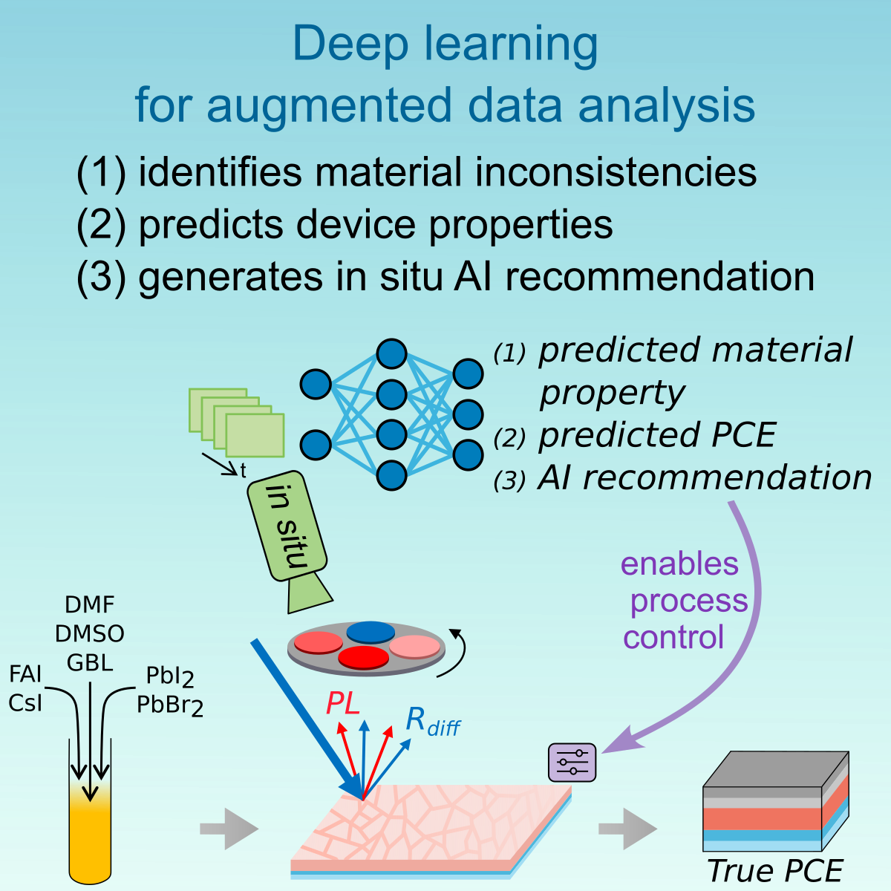

# Deep learning for augmented process monitoring of scalable perovskite thin-film fabrication

This repository contains the code and dataset for the paper **"Deep learning for augmented process monitoring of scalable perovskite thin-film fabrication"**. The project explores the use of deep learning for material classification, device performance prediction, and process control in the fabrication of blade-coated perovskite solar cells.


<p align="center">
    
    <br>
    adapted from original publication
</p>


## Dataset Overview

The dataset, **In Situ Photoluminescence Dataset for Exploring Material and Processing Variabilities in Blade-Coated Perovskite Photovoltaics**, includes:
- Time-resolved in situ photoluminescence (PL) and diffuse reflection imaging data.
- Material-level properties: precursor composition (molarity and molar ratio).
- Device-level performance metrics: power conversion efficiency (PCE), open-circuit voltage (VOC), short-circuit current density (JSC), and fill factor (FF).

The dataset can be downloaded from [Zenodo](https://doi.org/10.5281/zenodo.14609789).

## Getting Started

### Prerequisites
- Required packages can be installed using:
`
pip install -r requirements.txt
`


### Setup
1. **Clone the repository:**
git clone https://github.com/PerovskitePV/DL-Fabrication-Monitoring cd DL-Fabrication-Monitoring

2. **Download the dataset:**
Save `data.h5` from [Zenodo](https://doi.org/10.5281/zenodo.14609789) in the `data/` folder.
3. **Download the forecasting models:**
Save the random forest models from Zenodo in the `models/forecasting_models/` folder.

### Reproducing the Results
The repository includes the following scripts to reproduce the results from the paper **"Deep learning for augmented process monitoring of scalable perovskite thin-film fabrication"**.   

#### Structure
```
├── README.md                                                           
├── requirements.txt                                        - txt-file to install the environment
├── 00a_generate_Material_train_test_folds.ipynb            - Script to generate the same Material train-test-splits and the same folds for cross-validation
├── 00b_generate_PCE_train_test_folds.ipynb                 - Script to generate the same PCE train-test-splits and the same folds for cross-validation
├── 01_material_composition_monitoring_molar_ratio.ipynb    - Script to reproduce results shown in Fig 2 (and S6b)
├── 02_material_composition_monitoring_molarity.ipynb       - Script to reproduce results shown in Fig 2 (and S6a)
├── 03_device_performance_prediction.ipynb                  - Script to reproduce results shown in Fig 3 (and S11)
├── 04_signal_forecasting.ipynb                             - Script to reproduce results shown in Fig S13 and S14
├── 05_forecasting_and_performance_prediction.ipynb         - Script to reproduce results shown in Fig 5 & 6 (and S15)
├── data
|   └── ...                                                 - data.h5 has to be downloaded from zenodo
├── models
|   ├── regression_model     
|   |   └── model_weights.pth                               - weights for the regression model
|   └── forecasting_models   
|       ├── ...                                             - random forest model have to be downloaded from zenodo
|       └── ...                                             
└── images
    └── concept.png                                         - project's concept overview  
```


